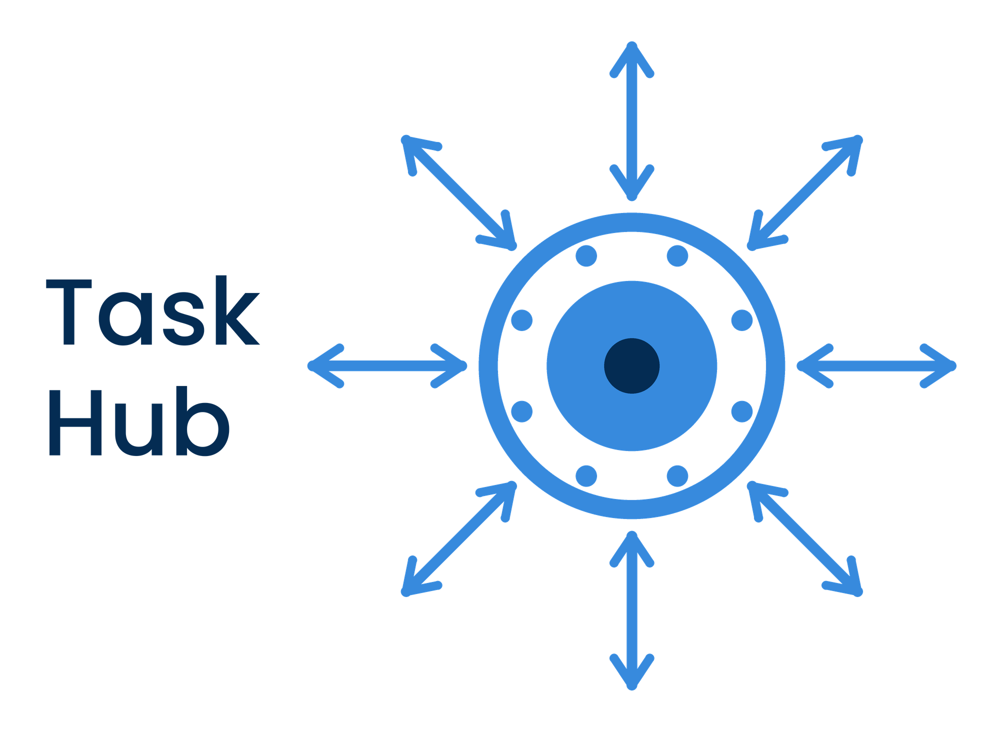

<p align="center">
  <picture>
    <source media="(prefers-color-scheme: dark)" srcset="assets/logo-color-reversed.png">
    
  </picture>
</p>

<p align="center">
  <strong>A planner for your Supernote. Every calendar, not just one.</strong><br>
  Runs against your own server. Your data never leaves it.
</p>

<p align="center">
  <a href="https://github.com/Sparkinman/task-hub"><strong>➜ Task Hub — the self-hosted server</strong></a><br>
  <sub>One command to install, runs on a Raspberry Pi. Recommended for tasks and calendars, not required for notes.</sub>
</p>

---

## Why

Ratta's own calendar subscribes to **exactly one** calendar. A work calendar, a family one
and a couple of shared ones mean choosing which single one the tablet gets to show. Its
planner has no year view, no quarter view, and no way to attach a note to a week or a month.
Its to-do list has no sub tasks and no priority.

This plugin is a planner that does those things, on the device, on the page you are already
writing on.

|  | Built-in | Task Hub plugin |
| --- | :---: | :---: |
| Calendars shown at once | 1 | **as many as you watch** |
| Views | month, agenda | **year, quarter, month, week, day** |
| Create and edit events on device | ✓ | ✓ **including repeat rules** |
| Notes tied to a date | daily | **day, week, month, quarter, year** — each with its own folder and template |
| Notes for a future date | — | **✓ any date, pinned to that day** |
| Sub tasks | — | **✓ nested, folded, ordered by soonest step** |
| Task priority | — | **✓ high / medium / low** |
| Repeating tasks | — | ✓ |
| Handwriting → task | — | ✓ |

---

## What it does

### A planner across five scales

**Year, quarter, month, week and day.** The year is twelve grids with tappable quarter and
month headings; the quarter is three; the month has a week-number gutter that opens or
creates that week's note. Days carrying an event, an open task or a note are marked, so the
shape of a month is visible before you touch anything.

Tapping a day anywhere drops you into it. "Go to today" is one press from any view, and
switching views lands on today rather than wherever the last view happened to be pointing.

### Every calendar you watch, together

Tick as many CalDAV collections as you like and they appear in one calendar, each event
badged with the collection it came from. Create an event on the device, choose which calendar
it goes into, set a repeat rule, and it is written straight to the server.

**The day view's hours are yours to set.** A nine-to-five agenda gets nine-to-five rows, at a
readable size, instead of twenty-four cramped ones. Nothing is hidden by narrowing it:
all-day items stay at the top, anything earlier sits just under them, anything later goes
below the last hour — each with its time and its calendar.

### Notes pinned to a date — including dates that have not happened

A note for **a day, a week, a month, a quarter or a year**. Each kind has its own folder, its
own filename layout (`{YYYY}/{MM}-{MMMM}/{DATE}`, `{YYYY}/W{WW}`, `{YYYY}/{QQ}`), its own
template, and its own on/off switch.

Every button says **Open** or **Create** depending on whether that note already exists, and
that works for **any date, forward or back**. Plan next Tuesday from the month grid this
week: tap the day, create its note, write the plan. It is pinned to that date, the grid marks
it, and when Tuesday arrives the day view opens the same file.

Every day inside a period resolves to the same path, so Tuesday and Thursday cannot end up
with two different "weekly" notes. Weeks start on Sunday, matching the week view the button
is pressed from.

**Templates** come from the device's built-in set, your own `MyStyle` folder, or any PNG or
JPG anywhere on the device — three tabs, real thumbnails, and a search box. The template is
applied when the note is created; changing it later does not restyle notes you already have.

**Meeting notes** attach to a calendar event. A repeating event shares one note across every
occurrence; a one-off carries its date in the filename. The link is kept on the device and
never written back to CalDAV.

### Tasks, properly

Every watched list in one place, earliest-due first so overdue leads. Search, sort, tick off,
edit anything.

**Sub tasks.** A task with steps shows a fold arrow and a count, folded by default, with each
family placed by its **soonest outstanding step** — so a piece of work due this morning sits
with everything else due this morning, not at the bottom because the parent itself has no
date. Add them one per line when writing a task; they inherit its due date, and a line ending
`@2026-09-10` dates that step on its own.

**Priority** — high, medium, low — read across the whole RFC 5545 range and shown as a badge.
A task another client stored as `PRIORITY:3` stays a 3 when you edit its title here.

**Repeats** — daily, weekly, monthly, yearly. A rule this menu cannot name (every second
Tuesday, anything with `COUNT` or `UNTIL`) reads as *custom* and is left byte-identical.

Edits are **surgical text changes** to the calendar object rather than a reserialisation, so
`RRULE`, `ATTENDEE` and `X-` properties this plugin does not model survive untouched.
Completion is a conditional `PUT` with `If-Match` on the ETag: a task changed elsewhere since
the list loaded fails with a clear message instead of silently clobbering the other change.

### And it turns handwriting into tasks

Lasso a handwritten line on a NOTE page, tap **Task Hub**, and the on-device recogniser fills
in the title — editable before saving, which is where you fix a misread. Set a due date,
priority, repeat and sub tasks, pick which lists to file it into, save.

The page keeps a mark so the writing shows it became a task: a **box** around the strokes
(dashed, solid, underline or off), optionally the caption **"Task Hub"**, optionally a
**marker-pen wash** in a colour you choose. **Completing the task removes the mark again.**
Every part is off-switchable, because it writes into your own note.

The task remembers where it came from: a `↩ page` chip closes the plugin and reopens that
note at that page. Tapping the box on the page shows the Task Hub logo — the SDK's link types
are pages, files, documents, images and URLs, none of which can reach a plugin, and the image
says so rather than leaving you wondering.

### Built for e-ink

No animations, no spinners, no translucent overlays, no second Android window for a dialog —
each of those is a full-panel repaint on a screen that cannot afford one. Views and rows are
memoised so a repaint happens when something changed and not otherwise. Reloads fetch only
what a write invalidated.

It sizes itself to the panel: a Manta runs at full size, a Nomad at 70%, type and spacing
together, calibrated against both devices. **Settings → This device** shows what it detected.

### No server? Most of it still works

Settings save with nothing configured. The calendar views, all five kinds of note, templates
and page marks need no network at all. Only tasks, calendar events and capturing handwriting
as a task need somewhere to put them.

### Where tasks come from

Task Hub reads the `X-TASKHUB-ORIGIN` property and badges each item with the service it
originally came from — Google, Todoist, TickTick, Obsidian and others — so a list pulled
together from several places still tells you where each item started. Anything this plugin
creates is stamped `supernote`.

That property is set by a sync service bridging your CalDAV server to those other services;
without one, everything reads as third party and the plugin works exactly the same. The
plugin talks only to the server address you configure, and to nothing else.

### The server side

[**Task Hub**](https://github.com/Sparkinman/task-hub) is the server this plugin is built
alongside: self-hosted, one command to install, runs happily on a Raspberry Pi. It is what
sets `X-TASKHUB-ORIGIN`, bridges Google / Todoist / TickTick / Obsidian / Apple / Microsoft
into one place, syncs the Supernote's own built-in To-Do app both ways, and gives you a web
view of the same tasks and calendars this plugin shows.

You do not need it. Any CalDAV server works — Radicale on its own is enough — and the note
features need no server at all. But if you want the tasks on your Supernote to be the same
tasks as everywhere else, that is what does it.

---

## Install

Grab `TaskHub.snplg` from [Releases](../../releases), copy it to `MyStyle/` on the device,
then **Settings → Apps → Plugins → Add Plugin**.

Use **Add Plugin** rather than reinstalling an existing entry: reinstall reads the host's own
managed copy under `MyStyle/Plugins/`, not the file you just copied across, so a new build
appears to do nothing.

Then open the plugin's settings, enter your server address and login, tap **Discover**, and
tick the task lists and calendars to watch.

Need a server? [**Task Hub**](https://github.com/Sparkinman/task-hub) installs with one
command and runs on a Raspberry Pi. Or point this at any CalDAV server you already have. Or
skip it entirely — the note and calendar-view features work without one, and settings save
with nothing ticked.

### Try it without a server

`TaskHubDemo.snplg` is the same plugin filled with sample data. It **requests no permissions
at all**, has no network access, and refuses every write — it exists so you can see and use
the thing before deciding whether to set up a server. It installs alongside the real one and
says "Task Hub Demo" on every screen.

---

## Build from source

```bash
npx tsc --noEmit                  # must pass first — Metro does not typecheck
npx eslint . --ext .ts,.tsx,.js
npx jest                          # 350 tests
./buildPlugin.sh                  # -> build/outputs/TaskHub.snplg
# Windows: .\buildPlugin.ps1 and .\buildDemo.ps1
```

`buildPlugin.sh` exits non-zero and packages nothing if the APK step fails. That matters:
`build/generated` is never cleared, so an earlier build's `app.npk` is sitting there, and a
script that carried on would zip a new JS bundle around a stale native payload and report
success.

Needs the Android SDK with NDK 27.0.12077973, a JDK, Node, and Python 3 on PATH.
[HANDOFF.md](HANDOFF.md) carries the full setup, the architecture, and the bugs worth not
rediscovering.

Both plugins are built from this one source tree — there is no fork. `buildDemo.ps1` flips a
compile-time flag, swaps the plugin config, builds, and restores everything.

---

## Naming — do not drift

This repository is named for what it is; the code inside is named `TaskHub`, one word. That
is deliberate and load-bearing — do not "tidy" it to match the repo.

`app.json`'s `name` and `PluginConfig.json`'s `pluginKey` **must stay identical**. A mismatch
installs cleanly and then does nothing at all: no buttons, no settings, no error. `pluginID`
must never change once distributed — it is what identifies the plugin to the device.
`package.json`'s `name` sets the `.snplg` and `.bundle` filenames.

## Pinned versions — do not drift

`react-native` is pinned to `0.79.2` by the on-device PluginHost runtime, not by convention.
`react`, `react-test-renderer` and `@types/react` must all stay at exactly `19.0.0`: npm's
`^19.0.0` peer range will happily install `19.2.x`, which fails **silently on-device** with
`Incompatible React versions` before the first render. Nothing shows up in `npm test`.

## Permissions

`INTERNET` for your CalDAV server, and `FILE:READ` / `FILE:WRITE` for daily notes, meeting
notes, and the settings file. Settings are stored as JSON in `Document/TaskHub/settings.json`
— outside the plugin's private directory, so they survive updates and reinstalls.

That file is **plain text on shared storage**, password included; a plugin has no access to a
keystore. Prefer a CalDAV credential scoped to the collections you use over an account
password. **Settings → Wipe All Save Data** clears it, since uninstalling does not.

## Licence

Public to read, and free to install and use on your own device. **This is not open source**:
no licence is granted to fork, modify, redistribute or bundle it into another project. All
rights are reserved.

## Known limits

- Handwriting inside plugin views is impossible on this firmware — showing a plugin view
  gates the EMR pen at the hardware level. Capture via lasso on the page is the supported
  path; finger touch works normally in the UI.
- `TZID` is treated as device-local. No timezone database is bundled, so a foreign-zone event
  can sit an hour out — better than dropping it.
- One-way for now: nothing is read back beyond listing. No un-complete, no dedupe, no
  offline queue.
- The marker-pen wash and the caption are separate elements from the box, so moving the
  handwriting leaves them behind — the SDK gives no way to group them. Only the box travels
  with the strokes.
- The wash covers the lasso selection, which is very slightly inside the box the host draws
  around it. The host does not report where that border goes and the SDK offers no way to
  ask, so it cannot be made to line up exactly. Shading is off by default.
- A link on the page cannot open the plugin. The SDK's link types are note page, note file,
  document, image and URL, so the box points at an image that says so. Going the other way —
  from a task to its page — works, via the `↩ page` chip.
